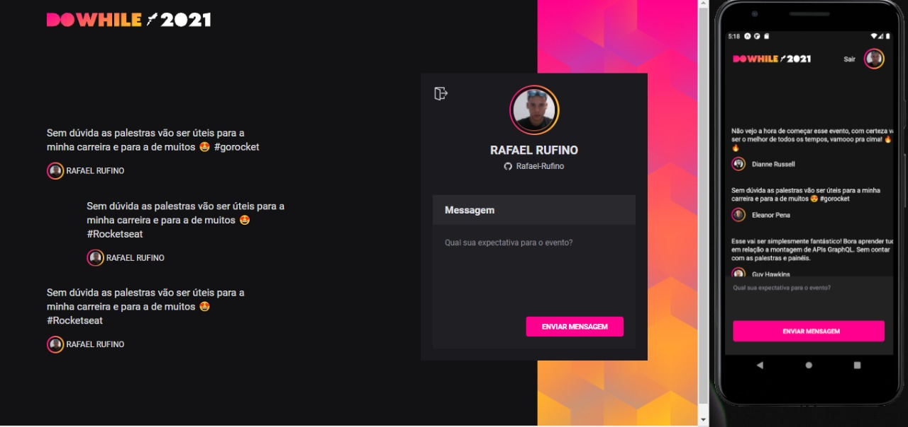

<h3 align="center">
    
    <br><br>
    <b>Envie e compartilhe suas mensagem</b><br>
    <b>Tire as dúvidas da sua audiência em tempo-real sobre o evento DoWhile</b>  
    <br>
</h3>


<p align="center">
  <a href="#sobre">Projeto</a>&nbsp;&nbsp;&nbsp;|&nbsp;&nbsp;&nbsp;
  <a href="#tecnologias-utilizadas">Tecnologias</a>&nbsp;&nbsp;&nbsp;|&nbsp;&nbsp;&nbsp;
  <a href="#como-usar">Como Usar</a>&nbsp;&nbsp;&nbsp;|&nbsp;&nbsp;&nbsp;
  <a href="#Como-Contribuir">Como Contribuir</a>
</p>

<p align="center">
 

  
</p>

<br>


<a id="sobre"></a>


## :bookmark: Sobre

O <strong>DoWhile</strong> é uma aplicação backend, frontend e mobile voltada para ajudar seu público, durante o evento tirando duvidas frequentes de forma rápidas e organizada.

Essa aplicação foi construída na trilha <strong>Next Level Week Heat</strong> distribuída pela Rocketseat. 


<a id="tecnologias-utilizadas"></a>

## :rocket: Tecnologias Utilizadas

O projeto foi desenvolvido utilizando as seguintes tecnologias

- [React](https://pt-br.reactjs.org/)
- [TypeScript](https://www.typescriptlang.org/)
- [Nodejs](https://node.google.com/docs)
- [React native](https://reactNative.google.com/docs)
- [Prisma](https://prisma.google.com/docs)
- [Socket.Io](https://socket.io.google.com/docs)
- [Express](https://express.google.com/docs)
- [Json Web Token](https://jsonwentoken.google.com/docs)

## :heavy_check_mark: :computer: Prototipo da Aplicação

- o layout está disponível no **[Figma](https://www.figma.com/community/file/1031699316177416916)**;
<br>


## :heavy_check_mark: :computer: Resultado Web


<h1 align="center">
    

</h1>

<a id="como-usar"></a>

## :fire: Como usar

- ### **Pré-requisitos**

  - É **necessário** possuir o **[Node.js](https://nodejs.org/en/)** instalado na máquina
  - Também, é **preciso** ter um gerenciador de pacotes seja o **[NPM](https://www.npmjs.com/)** ou **[Yarn](https://yarnpkg.com/)**.
  


1. Faça um clone :

```sh
  git clone https://github.com/Rafael-Rufino/LetMeask
```

2. Executando a Aplicação:

```sh
  # Instale as dependências
  $ npm install 
  #ou
  $ yarn 


  # Inicie a aplicação web
  $ cd nlw_heat
  - Backend
  $ yarn dev
  #
  - Web 
  $ yarn dev
  #
  - Mobile
  $ expo start


```
  
<a id="Como-Contribuir"></a>


## :recycle: Como contribuir

- Faça um Fork desse repositório,
- Crie uma branch com a sua feature: `git checkout -b my-feature`
- Commit suas mudanças: `git commit -m 'feat: My new feature'`
- Push a sua branch: `git push origin my-feature`


🎓 **Quem ministrou?**

As aulas foram ministradas pelo mestre Diego fernandes, Daniele Evangelista, Rodrigo Gonçaves - Instructor - Rocketseat nas aulas da Next Level Week Heat.

📝 **License**

Esse projeto está sob a licença MIT. Veja o arquivo [LICENSE](LICENSE.md) para mais detalhes.


<h4 align="center">
    Feito com 💜 by <a href="https://www.linkedin.com/in/rafael-r-dos-santos-b889311ba/" target="_blank">Rafael Rufino</a>
</h4>


